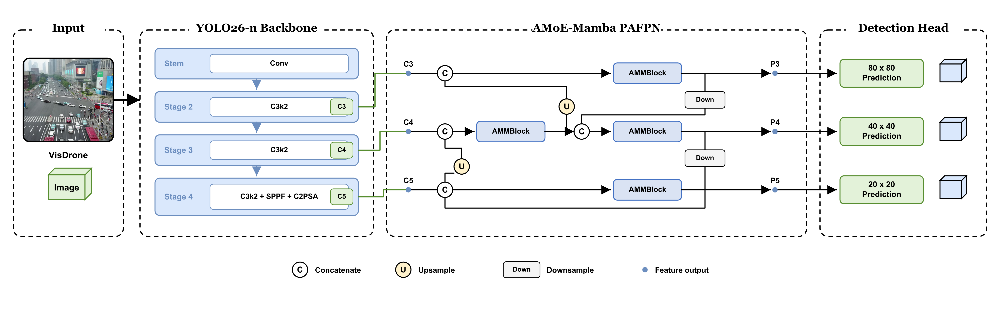
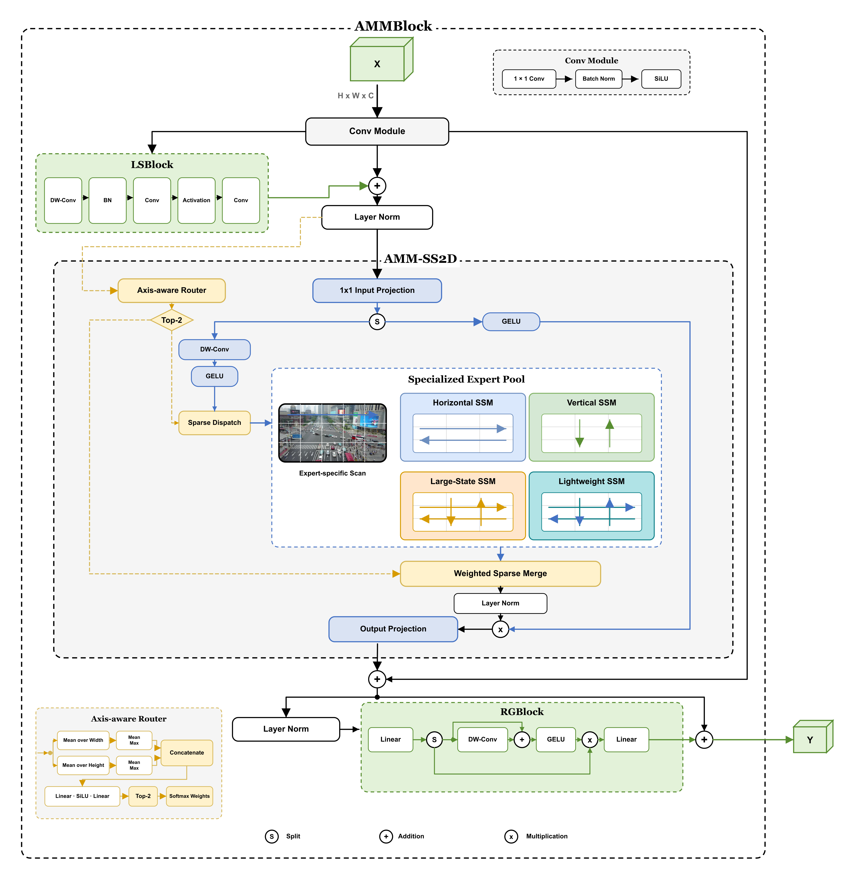

# AMoE-Mamba-YOLO: An Axis-Aware Mixture of Mamba Experts for Real-Time Object Detection

Zhuoer Yu, Guangyu Wu

[](https://www.python.org/)
[](https://pytorch.org/)
[](LICENSE)



AMoE-Mamba-YOLO introduces axis-aware sparse Mamba experts into multiscale feature fusion. Each AMMBlock selects two experts from a horizontal SSM, a vertical SSM, a large-state SSM, and a lightweight SSM. The standard backbone and detection head are retained.



## Model Zoo

Models were trained from scratch on VisDrone2019-DET for 100 epochs at 640 pixels. The table reports the paper results for seed 20260821 on all 548 validation images using `pycocotools.COCOeval`, a confidence threshold of 0.001, and at most 500 detections per image.

| Model | AP | AP50 | AP75 | APS | APM | AR500 | Weights |
|---|---:|---:|---:|---:|---:|---:|---|
| YOLOv8-N | 13.623 | 24.179 | 13.265 | 6.290 | 21.443 | 22.007 | - |
| YOLOv10-N | 13.955 | 25.504 | 13.451 | 6.976 | 21.083 | 29.763 | - |
| YOLO11-N | 13.075 | 23.345 | 12.509 | 6.125 | 20.305 | 21.460 | - |
| YOLO26-N | 12.704 | 23.961 | 11.571 | 6.448 | 19.107 | 27.549 | - |
| Mamba-YOLO-T | 13.008 | 22.864 | 12.657 | 5.906 | 20.889 | 20.789 | - |
| **AMoE-Mamba-YOLO-N** | **14.176** | **25.977** | **13.516** | **7.172** | **21.570** | **29.820** | [v0.1.0](https://github.com/ZhuoerYu/AMoE-Mamba-YOLO/releases/tag/v0.1.0) |

The complete main comparison and controlled ablations are in [`results/paper_coco_metrics.csv`](results/paper_coco_metrics.csv). Axis-Top2 reaches 14.176 AP and runs at 8.940 ms in the reported RTX 5090 FP16 protocol; Axis-Top4 reaches 14.228 AP at 11.069 ms.

## Getting started

### 1. Installation

```bash
conda create -n amoe-mamba-yolo python=3.11 -y
conda activate amoe-mamba-yolo

git clone https://github.com/ZhuoerYu/AMoE-Mamba-YOLO.git
cd AMoE-Mamba-YOLO

pip install torch==2.10.0 torchvision==0.25.0 --index-url https://download.pytorch.org/whl/cu128
pip install -r requirements/base.txt
pip install -e .
pip install -r requirements/cuda.txt
pip install ./selective_scan --no-build-isolation
```

The selective-scan extension requires an NVIDIA GPU, a CUDA toolkit, and a compiler compatible with the installed PyTorch build.

### 2. Data preparation

Download the official VisDrone2019-DET train and validation splits, then convert the annotations:

```bash
python scripts/prepare_visdrone.py \
  --source /path/to/VisDrone/raw \
  --output datasets/VisDrone2019-DET \
  --yaml configs/visdrone.local.yaml
```

The expected directory layout is described in [docs/DATA.md](docs/DATA.md).

### 3. Training

Train the proposed model with the reported protocol:

```bash
python scripts/train.py --data configs/visdrone.local.yaml --device 0
```

Run the four placement controls over all three seeds:

```bash
python scripts/reproduce_visdrone.py \
  --config configs/main_experiments.yaml \
  --device 0
```

### 4. Evaluation

```bash
python scripts/evaluate.py \
  --weights amoe-mamba-yolo-n-visdrone-seed20260821.pt \
  --data configs/visdrone.local.yaml \
  --device 0
```

### 5. Inference

```bash
python scripts/predict.py \
  --weights amoe-mamba-yolo-n-visdrone-seed20260821.pt \
  --source /path/to/images \
  --device 0
```

Configuration details, ablation commands, and checkpoint hashes are listed in [docs/REPRODUCTION.md](docs/REPRODUCTION.md) and [docs/MODEL_ZOO.md](docs/MODEL_ZOO.md).

## Acknowledgement

This repository is built on [Ultralytics](https://github.com/ultralytics/ultralytics), [YOLO-Master](https://github.com/Tencent/YOLO-Master), and [Mamba-YOLO](https://github.com/HZAI-ZJNU/Mamba-YOLO). We thank the authors for releasing their code. Licensing and source details are recorded in [THIRD_PARTY_NOTICES.md](THIRD_PARTY_NOTICES.md).

## Citation

```bibtex
@software{yu2026amoe_mamba_yolo,
  author  = {Zhuoer Yu and Guangyu Wu},
  title   = {AMoE-Mamba-YOLO: An Axis-Aware Mixture of Mamba Experts for Real-Time Object Detection},
  year    = {2026},
  version = {0.1.0},
  url     = {https://github.com/ZhuoerYu/AMoE-Mamba-YOLO}
}
```
